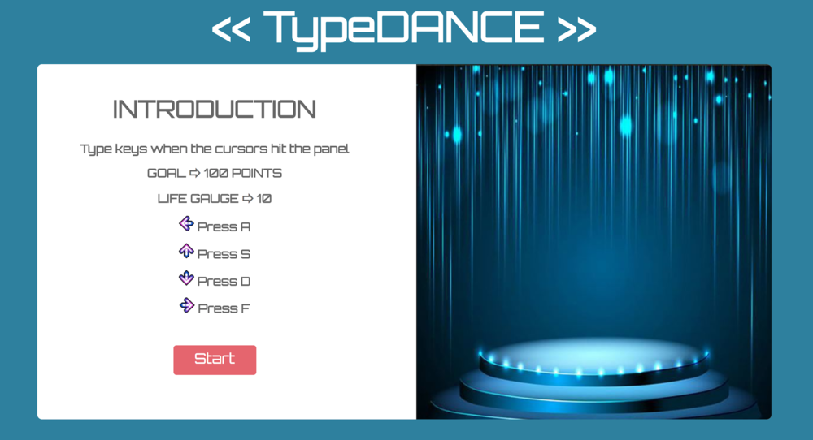
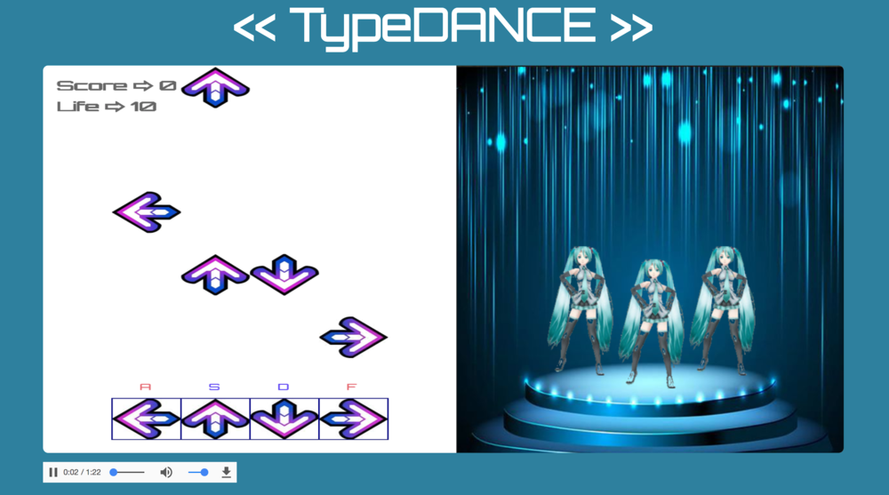

# TypeDANCE

[live TypeDANCE](https://hobara.github.io/TypeDance/)

TypeDANCE is an interactive dance app inspired by Dance Dance Revolution, built by using JavaScript, HTML/CSS and Sprite sheet canvas.



### Features & Implementation
TypeDance uses Sprite sheet canvas to render images, and JavaScript to manipulate motions.
Half of the page on the left is a command canvas that allows users to play with rhythms, and the other half is a dance canvas that renders the moves of commands that users typed.

Creating different types of rhythm.
``` javascript class Rhythm {
constructor(canvas, ctx, x, y) {
  this.canvas = canvas;
  this.ctx = ctx;
  this.x = x;
  this.y = y;
}

drawRhythm() {
  this.ctx.beginPath();
  this.ctx.rect(this.x, this.y, 100, 100);
  if (this.x === 100) {
    this.ctx.drawImage(rhythmLeft, this.x, this.y);
  } else if (this.x === 200) {
    this.ctx.drawImage(rhythmUp, this.x, this.y);
  } else if (this.x === 300) {
    this.ctx.drawImage(rhythmDown, this.x, this.y);
  } else if (this.x === 400) {
    this.ctx.drawImage(rhythmRight, this.x, this.y);
  }
  this.ctx.save();
  this.ctx.closePath();
}
}
```



Event Listener checks to see if the rhythm matches with the command users typed, and update the motion of the dancers on the right.  
``` javascript document.addEventListener("keydown", (e) => {
      e.preventDefault();
      if (e.keyCode === 65) {
          command.pressedA = true;
          dancer.moveA();
        } else if (e.keyCode === 83) {
          command.pressedS = true;
          dancer.moveS();
        } else if (e.keyCode === 68) {
          command.pressedD = true;
          dancer.moveD();
        } else if (e.keyCode === 70) {
          command.pressedF = true;
          dancer.moveF();
        }
    });
```

### Future Implementation
- [ ] Apply different difficulties (level 1 to 3).
- [ ] Build multiple players mode (two players can compete).
