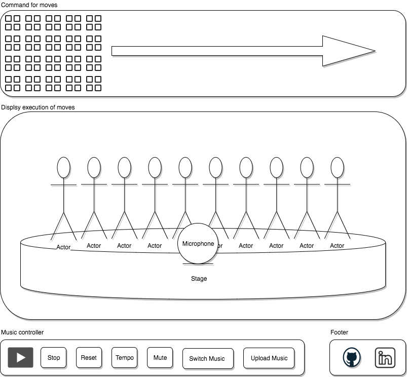

## TypeDANCE

[live TypeDANCE](https://hobara.github.io/TypeDance/)

TypeDANCE is a single page interactive app, that visually let dancers move based on your command, so that users can enjoy letting dancers move in synchronicity with music. Built by JavaScript, jQuery and HTML/CSS.  

### Functionality & MVP  

TypeDANCE will provide the following functionality to users:

- [ ] Play/Pause/Restart/Mute music  
- [ ] Select move-command from move options  
- [ ] Update/Reset move-command board  
- [ ] Move microphone object
- [ ] Microphone object updates dancer's move
- [ ] Control tempo of music
- [ ] Switch music

### Wireframes

This app will consist of a single screen with 'Move-command board', 'Dancer board' and 'Music controller'.

Move-command board will contain sequences of move-commands(grids). Once user clicks play music button, move-command board will execute each move-command(grid) every second and make dancers move in dancer board. User can update move-commands(grids) as they like, and restart music.   

In dancer board, user can move microphone object that will distract dancer's focus and moves. For example, all dancers gather to the microphone object when user clicks the microphone, dancers will flip over when microphone hit the dancer.  

Music controller will execute to play, pause, restart and mute music. Also, user can control tempo of music and switch music.

### Architecture and Technologies

This app will be implemented by the following technologies:

* Vanilla JavaScript and jQuery for overall structure
* HTML/CSS for rendering
* Webpack to bundle scripts

There will be 2 main scripts for the functionality of this project:
`moves.js` will handle the logic for moves.
`board.js` will handle logic for the state of dancers.

The underlying game logic will be implemented using vanilla JavaScript by following an object-oriented design pattern. The board elements and user interaction with leverage `ReactJS` to provide a simple and highly performant UI implementation.

### Implementation Timeline

### Day 1: Setup
Setup all necessary Node modules and make `webpack.config.js` and `package.json`.
Write a basic entry file and the bare bones of 2 scripts outlined above, and display 'Move-command board' and 'Dancer board'.

### Day 2: Create logic for each move
Create each move-command object and work on the logic for each move to update the state of dancers. Work on the logic for microphone that will also update the state of dancers.  

### Day 3: Create logic for move-command board
Fill the move-command board with move-command objects(grids) and run the functional board that keeps updating the board.
After testing, work on the controller to update/pause/restart the move-command board.

### Day 4: User Interface
Finish CSS styling, seeding sample music and installing music controller for updating tempo.
Add functionality to switch music.

### Bonus Features
* Upload music
